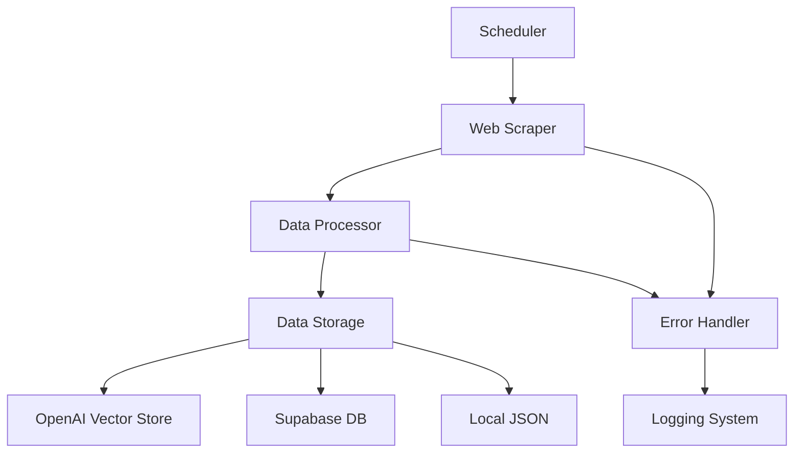
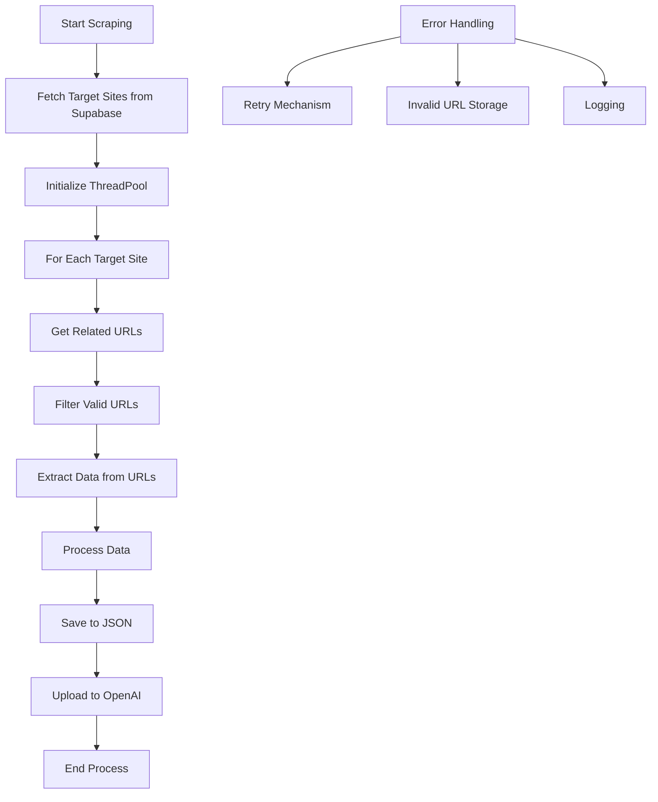
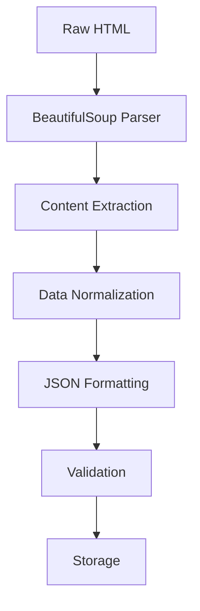
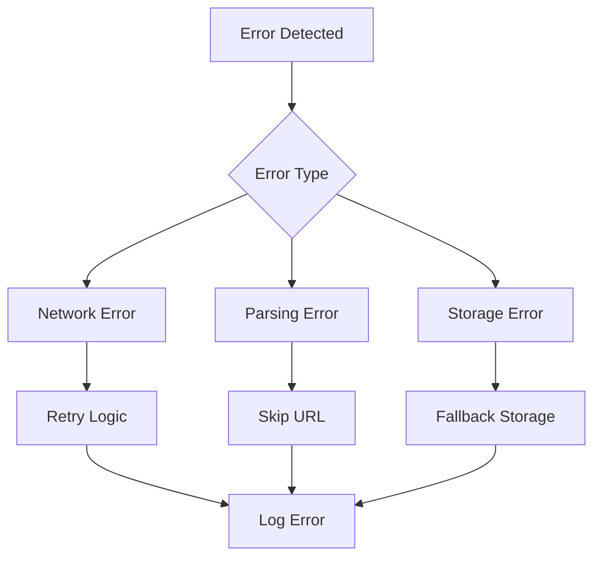
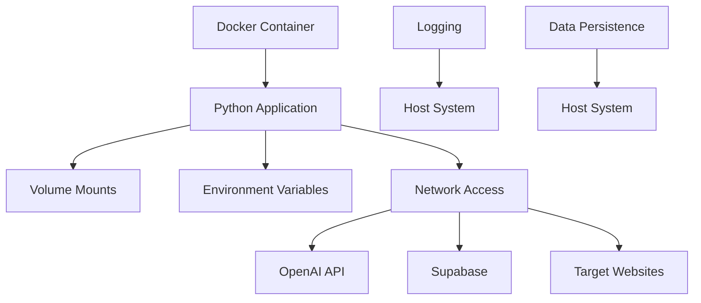
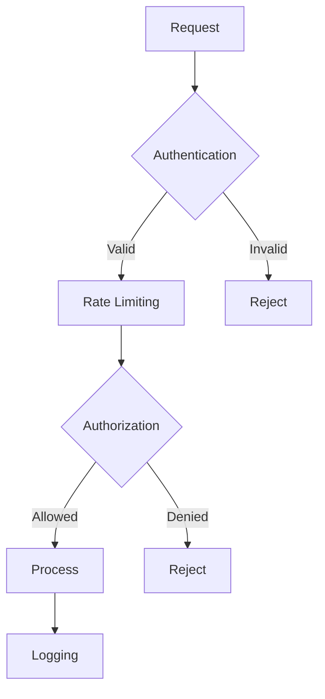
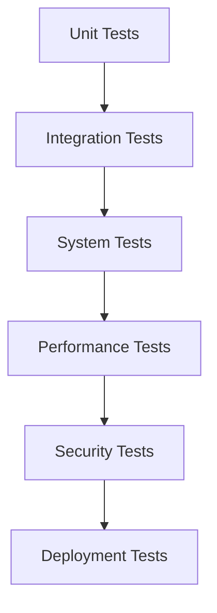
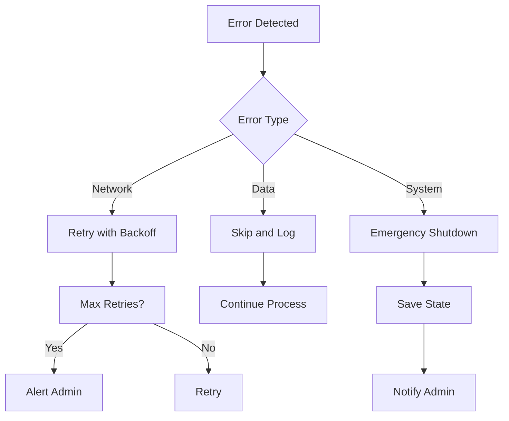
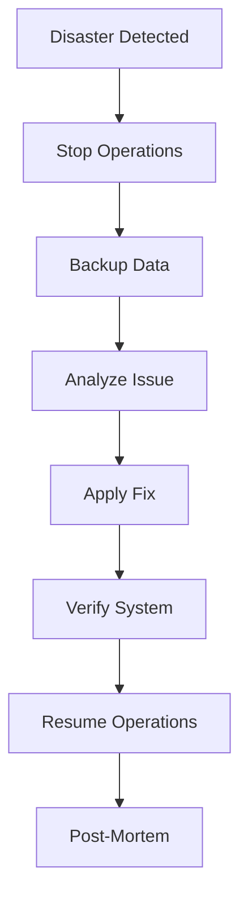
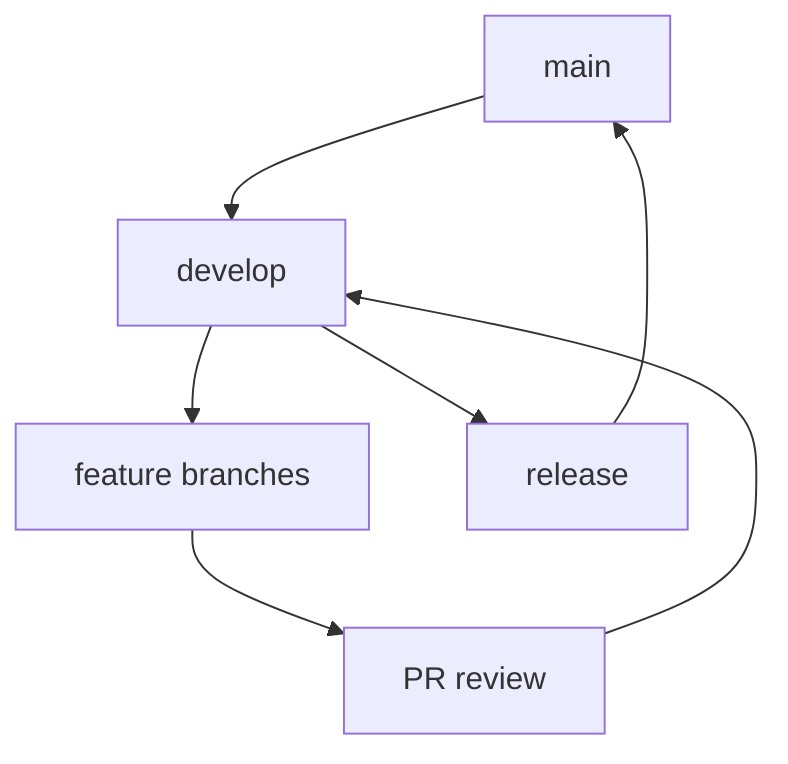

# Project Development Documentation
Date: [30-03-2025]

## Project Overview
We've developed a web scraper system that focuses on collecting mobile-related data from Swiss telecommunications providers (Swisscom, Sunrise, and Salt). The system integrates with OpenAI's vector store and uses Supabase for managing target sites.

## System Architecture

### Block Schema: High-Level System Overview


### Block Schema: Scraping Flow


## Components Implemented

### 1. Core Scraping System (`main.py`)
#### Web Scraper Class
```python
class WebScraper:
    def __init__(self, max_workers=5, max_retries=3):
        self.max_workers = max_workers
        self.max_retries = max_retries
        self.session = self._create_session()
        self.invalid_urls = set()
```

Key Features:
- Multi-threaded processing (ThreadPoolExecutor)
- Retry mechanism with exponential backoff
- Session management with connection pooling
- URL validation and cleaning
- Comprehensive error handling

#### Request Management
- Custom session configuration with retries
- Connection pooling for performance
- Timeout handling
- User-agent rotation (planned)

### 2. OpenAI Integration
```python
class OpenAIUploader:
    def __init__(self, api_key, assistant_id, vector_store_id):
        self.client = OpenAI(api_key=api_key)
        self.assistant_id = assistant_id
        self.vector_store_id = vector_store_id
```

Features:
- File upload management
- Vector store integration
- Assistant API integration
- Automatic file cleanup

### 3. Database Schema (Supabase)
```sql
create table if not exists target_sites (
    id uuid default uuid_generate_v4() primary key,
    url text not null,
    topic text not null,
    created_at timestamp with time zone default timezone('utc'::text, now()) not null
);

create index if not exists target_sites_url_idx on target_sites(url);
```

### 4. Data Processing Pipeline

#### Block Schema: Data Processing Flow


#### Data Structure
```json
{
    "url": "string",
    "data": {
        "title": "string",
        "description": "string",
        "body": "string"
    },
    "metadata": {
        "scraped_at": "timestamp",
        "source": "string",
        "version": "string"
    }
}
```

### 5. Error Handling System

#### Block Schema: Error Handling Flow


#### Error Categories:
1. Network Errors
   - Connection timeouts
   - DNS failures
   - SSL errors
   - Rate limiting

2. Parsing Errors
   - Invalid HTML
   - Missing data
   - Structure changes

3. Storage Errors
   - Database connection issues
   - File system errors
   - API failures

### 6. Monitoring and Logging

#### Logging Structure
```python
logging.basicConfig(
    level=logging.INFO,
    format='%(asctime)s - %(levelname)s - %(message)s',
    handlers=[
        logging.FileHandler('scraper.log'),
        logging.StreamHandler()
    ]
)
```

#### Metrics Collected:
- Request success/failure rates
- Processing times
- Data volume
- Error frequencies
- Resource usage

## Technical Specifications

### Environment Requirements
```yaml
Python: ">=3.9"
Memory: ">=2GB"
Storage: ">=1GB"
CPU: ">=2 cores"
```

### Dependencies
```toml
[packages]
requests = "^2.31.0"
beautifulsoup4 = "^4.12.0"
openai = "^1.3.0"
python-dotenv = "^1.0.0"
schedule = "^1.2.0"
supabase = "^2.0.0"
```

## Key Features Implemented

1. **Web Scraping**
   - Multi-threaded processing
   - URL discovery based on topics
   - Content extraction (title, description, body)
   - Error handling and retries

2. **Data Processing**
   - JSON output formatting
   - Data normalization
   - Duplicate URL removal

3. **Automation**
   - Scheduled execution
   - Continuous monitoring
   - Automatic file management

## Current Data Structure

The system generates data in the following format:
```json
{
    "url": "https://example.com",
    "data": {
        "title": "Page Title",
        "description": "Meta Description",
        "body": "Page Content"
    }
}
```

## Environment Configuration

```env
OPENAI_API_KEY=<key>
ASSISTANT_ID=<id>
VECTOR_STORE_ID=<id>
SUPABASE_URL=<url>
SUPABASE_KEY=<key>
```

## Database Schema

```sql
create table if not exists target_sites (
    id uuid default uuid_generate_v4() primary key,
    url text not null,
    topic text not null,
    created_at timestamp with time zone default timezone('utc'::text, now()) not null
);
```

## Current Target Sites
- Swisscom (https://www.swisscom.ch)
- Sunrise (https://www.sunrise.ch)
- Salt (https://www.salt.ch)

## Deployment Options

1. **Local Deployment**
   ```bash
   pip install -r requirements.txt
   python main.py
   ```

2. **Docker Deployment**
   ```bash
   docker compose up -d
   ```

## Testing Status
- Basic functionality testing completed
- Successfully scraping target sites
- OpenAI integration verified
- Supabase connection confirmed

## Known Limitations
1. Rate limiting considerations for target sites
2. Memory usage with large datasets
3. Dependency on external services (OpenAI, Supabase)

## Next Steps
1. Implement more robust error notification
2. Add data validation
3. Enhance content filtering
4. Add monitoring dashboard
5. Implement backup mechanisms

## Technical Debt
1. Need to add unit tests
2. Documentation for API responses
3. Performance optimization for large datasets
4. Security hardening

## Dependencies
```text
requests
beautifulsoup4
openai
python-dotenv
schedule
supabase
```

## Monitoring and Maintenance
- Log files location: Application root directory
- Data output: `data_objects.json`
- Docker container: `web-scraper`
- Scheduled run time: 2 AM daily

## Backup and Recovery
- Data is stored in:
  - Supabase database
  - Local JSON file
  - OpenAI vector store

## Security Considerations
1. API keys stored in environment variables
2. Docker container isolation
3. Rate limiting implementation
4. Error handling for sensitive data

## Support and Troubleshooting
1. Check application logs
2. Monitor Docker container status
3. Verify Supabase connection
4. Confirm OpenAI API status

## Version Control
- All code maintained in Git repository
- Docker images versioned
- Environment configurations tracked

This documentation represents the current state of the project as of today's implementation. It should be updated as new features are added or modifications are made to the existing functionality.

## Deployment Configuration

### Docker Configuration
#### Dockerfile Analysis
```dockerfile
FROM python:3.9-slim
WORKDIR /app
COPY requirements.txt .
RUN pip install --no-cache-dir -r requirements.txt
COPY . .
CMD ["python", "main.py"]
```

#### Docker Compose Configuration
```yaml
version: '3.8'
services:
  scraper:
    build: .
    container_name: web-scraper
    volumes:
      - .:/app
    environment:
      - OPENAI_API_KEY=${OPENAI_API_KEY}
      - ASSISTANT_ID=${ASSISTANT_ID}
      - VECTOR_STORE_ID=${VECTOR_STORE_ID}
    restart: unless-stopped
```

### Block Schema: Deployment Architecture


## Security Implementation

### Authentication & Authorization
1. API Key Management
```python
class SecurityManager:
    def __init__(self):
        self.api_keys = {
            'openai': os.getenv('OPENAI_API_KEY'),
            'supabase': os.getenv('SUPABASE_KEY')
        }
        self.validate_keys()
```

2. Environment Variable Protection
```python
def validate_environment():
    required_vars = [
        'OPENAI_API_KEY',
        'ASSISTANT_ID',
        'VECTOR_STORE_ID',
        'SUPABASE_URL',
        'SUPABASE_KEY'
    ]
    missing = [var for var in required_vars if not os.getenv(var)]
    if missing:
        raise EnvironmentError(f"Missing required environment variables: {missing}")
```

### Block Schema: Security Flow


## Testing Protocol

### Unit Tests
```python
class TestWebScraper(unittest.TestCase):
    def setUp(self):
        self.scraper = WebScraper()
        self.test_url = "https://test.example.com"

    def test_url_validation(self):
        self.assertTrue(self.scraper._is_valid_url(self.test_url))

    def test_data_extraction(self):
        data = self.scraper.extract_data_from_url(self.test_url)
        self.assertIsNotNone(data)
        self.assertIn('title', data)
```

### Integration Tests
```python
class TestIntegration(unittest.TestCase):
    def test_full_pipeline(self):
        # Test complete flow from scraping to storage
        job = Job()
        result = job.run()
        self.assertTrue(result.success)
        self.assertGreater(len(result.data), 0)
```

### Block Schema: Testing Pipeline


## Performance Optimization

### Caching System
```python
class CacheManager:
    def __init__(self):
        self.cache = {}
        self.cache_timeout = 3600  # 1 hour

    def get(self, key):
        if key in self.cache:
            if time.time() - self.cache[key]['timestamp'] < self.cache_timeout:
                return self.cache[key]['data']
        return None

    def set(self, key, value):
        self.cache[key] = {
            'data': value,
            'timestamp': time.time()
        }
```

### Thread Pool Management
```python
class ThreadPoolManager:
    def __init__(self, max_workers=5):
        self.max_workers = max_workers
        self.executor = ThreadPoolExecutor(max_workers=max_workers)
        self.active_tasks = set()

    def submit(self, fn, *args, **kwargs):
        future = self.executor.submit(fn, *args, **kwargs)
        self.active_tasks.add(future)
        future.add_done_callback(self.task_done)
        return future

    def task_done(self, future):
        self.active_tasks.remove(future)
```

## Error Recovery Mechanisms

### Block Schema: Error Recovery Flow


## Monitoring and Analytics

### Metrics Collection
```python
class MetricsCollector:
    def __init__(self):
        self.metrics = {
            'requests': Counter(),
            'errors': Counter(),
            'processing_time': Histogram(),
            'data_size': Gauge()
        }

    def record_request(self, success: bool):
        self.metrics['requests'].inc()
        if not success:
            self.metrics['errors'].inc()
```

### Health Checks
```python
class HealthChecker:
    def __init__(self):
        self.services = {
            'openai': self.check_openai,
            'supabase': self.check_supabase,
            'scraper': self.check_scraper
        }

    async def check_health(self):
        results = {}
        for service, check in self.services.items():
            results[service] = await check()
        return results
```

## Future Enhancements

1. **Advanced Scraping Features**
   - JavaScript rendering support
   - Dynamic content handling
   - Anti-bot detection measures

2. **AI Enhancements**
   - Content classification
   - Sentiment analysis
   - Trend detection

3. **Infrastructure Improvements**
   - Kubernetes deployment
   - Load balancing
   - Geographic distribution

4. **Monitoring Enhancements**
   - Real-time dashboards
   - Predictive analytics
   - Automated reporting

## API Documentation

### Internal APIs
```python
class ScraperAPI:
    async def start_job(self):
        """Start a new scraping job"""
        pass

    async def get_status(self, job_id: str):
        """Get job status"""
        pass

    async def cancel_job(self, job_id: str):
        """Cancel running job"""
        pass
```

### External APIs
- OpenAI Integration
- Supabase Queries
- Monitoring Endpoints

## Disaster Recovery

### Block Schema: Recovery Process


## Version Control Strategy

### Git Workflow


This completes the technical documentation. Would you like me to elaborate on any specific section?
