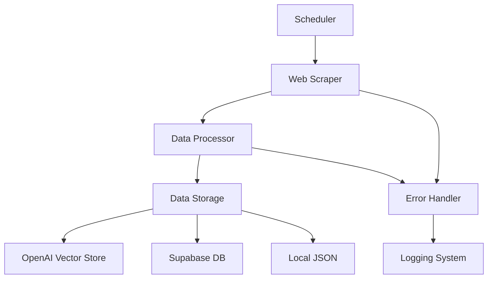
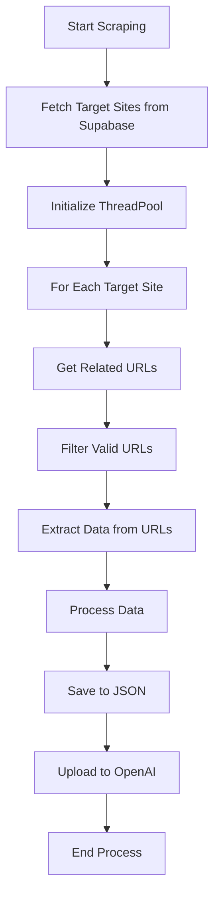
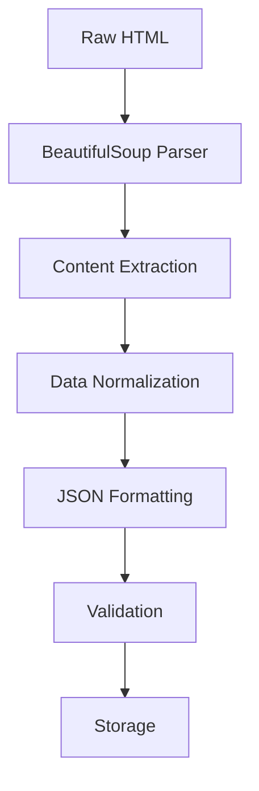

# Project Development Documentation
Date: [30-03-2025]

## Project Overview
We've developed a web scraper system that focuses on collecting mobile-related data from Swiss telecommunications providers (Swisscom, Sunrise, and Salt). The system integrates with OpenAI's vector store and uses Supabase for managing target sites.

## System Architecture

### Block Schema: High-Level System Overview


### Block Schema: Scraping Flow


## Components Implemented

### 1. Core Scraping System (`main.py`)
#### Web Scraper Class
```python
class WebScraper:
    def __init__(self, max_workers=5, max_retries=3):
        self.max_workers = max_workers
        self.max_retries = max_retries
        self.session = self._create_session()
        self.invalid_urls = set()
```

Key Features:
- Multi-threaded processing (ThreadPoolExecutor)
- Retry mechanism with exponential backoff
- Session management with connection pooling
- URL validation and cleaning

### 2. OpenAI Integration
```python
class OpenAIUploader:
    def __init__(self, api_key, assistant_id, vector_store_id):
        self.client = OpenAI(api_key=api_key)
        self.assistant_id = assistant_id
        self.vector_store_id = vector_store_id
```

Features:
- File upload management
- Vector store integration
- Assistant API integration
- Automatic file cleanup

### 3. Database Schema (Supabase)
```sql
create table if not exists target_sites (
    id uuid default uuid_generate_v4() primary key,
    url text not null,
    topic text not null,
    created_at timestamp with time zone default timezone('utc'::text, now()) not null
);

create index if not exists target_sites_url_idx on target_sites(url);
```

### 4. Data Processing Pipeline

#### Block Schema: Data Processing Flow


#### Data Structure
```json
{
    "url": "string",
    "data": {
        "title": "string",
        "description": "string",
        "body": "string"
    },
}
```

## Technical Specifications

### Environment Requirements
```yaml
Python: ">=3.9"
Memory: ">=2GB"
Storage: ">=1GB"
CPU: ">=2 cores"
```

### Dependencies
```toml
[packages]
requests = "^2.31.0"
beautifulsoup4 = "^4.12.0"
openai = "^1.3.0"
python-dotenv = "^1.0.0"
schedule = "^1.2.0"
supabase = "^2.0.0"
```

## Key Features Implemented

1. **Web Scraping**
   - Multi-threaded processing
   - URL discovery based on topics
   - Content extraction (title, description, body)

2. **Data Processing**
   - JSON output formatting
   - Data normalization

3. **Automation**
   - Scheduled execution
   - Continuous monitoring
   - Automatic file management

## Environment Configuration

```env
OPENAI_API_KEY=<key>
ASSISTANT_ID=<id>
VECTOR_STORE_ID=<id>
SUPABASE_URL=<url>
SUPABASE_KEY=<key>
```

## Current Target Sites
- Swisscom (https://www.swisscom.ch)
- Sunrise (https://www.sunrise.ch)
- Salt (https://www.salt.ch)

## Deployment Options

1. **Local Deployment**
   ```bash
   pip install -r requirements.txt
   python main.py
   ```

2. **Docker Deployment**
   ```bash
   docker compose up -d
   ```

## Next Steps
1. Implement more robust error notification
2. Add data validation
3. Enhance content filtering
4. Add monitoring dashboard
5. Implement backup mechanisms

## Technical Debt
1. Need to add unit tests
2. Documentation for API responses
3. Performance optimization for large datasets
4. Security hardening

## Monitoring and Maintenance
- Log files location: Application root directory
- Data output: `data_objects.json`
- Docker container: `web-scraper`
- Scheduled run time: 2 AM daily

## Backup and Recovery
- Data is stored in:
  - Supabase database
  - Local JSON file
  - OpenAI vector store

## Support and Troubleshooting
1. Check application logs
2. Monitor Docker container status
3. Verify Supabase connection
4. Confirm OpenAI API status

This documentation represents the current state of the project as of today's implementation. It should be updated as new features are added or modifications are made to the existing functionality.

## Deployment Configuration

### Docker Configuration
#### Dockerfile Analysis
```dockerfile
FROM python:3.9-slim
WORKDIR /app
COPY requirements.txt .
RUN pip install --no-cache-dir -r requirements.txt
COPY . .
CMD ["python", "main.py"]
```

#### Docker Compose Configuration
```yaml
version: '3.8'
services:
  scraper:
    build: .
    container_name: web-scraper
    volumes:
      - .:/app
    environment:
      - OPENAI_API_KEY=${OPENAI_API_KEY}
      - ASSISTANT_ID=${ASSISTANT_ID}
      - VECTOR_STORE_ID=${VECTOR_STORE_ID}
    restart: unless-stopped
```

## Future Enhancements

1. **Advanced Scraping Features**
   - JavaScript rendering support
   - Dynamic content handling
   - Anti-bot detection measures

2. **AI Enhancements**
   - Content classification
   - Sentiment analysis
   - Trend detection

3. **Infrastructure Improvements**
   - Kubernetes deployment
   - Load balancing
   - Geographic distribution

4. **Monitoring Enhancements**
   - Real-time dashboards
   - Predictive analytics
   - Automated reporting