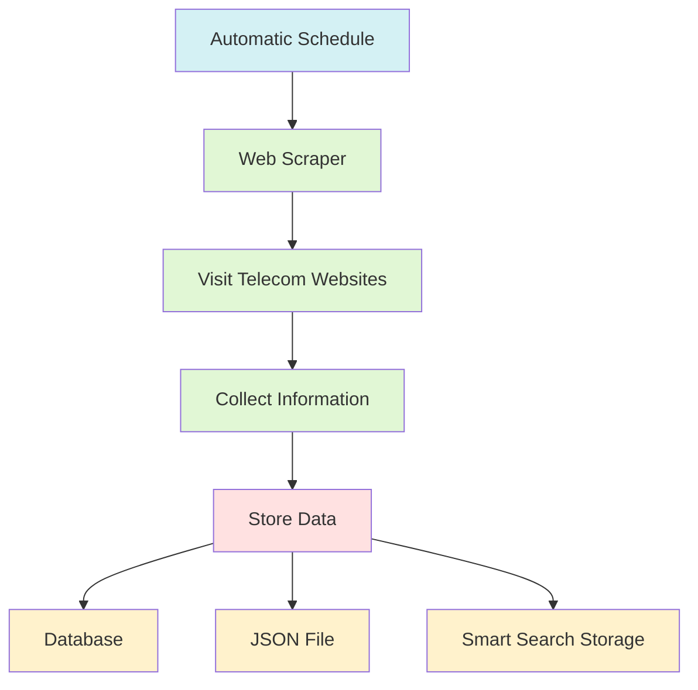
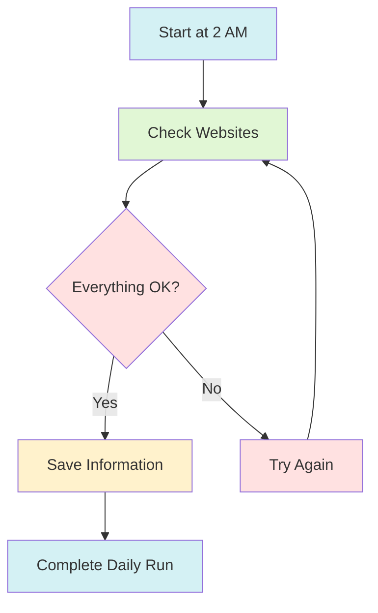
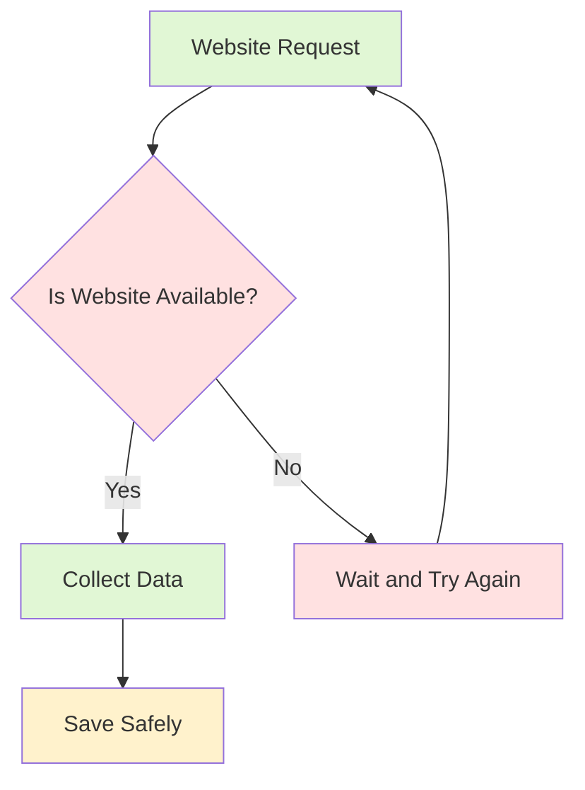
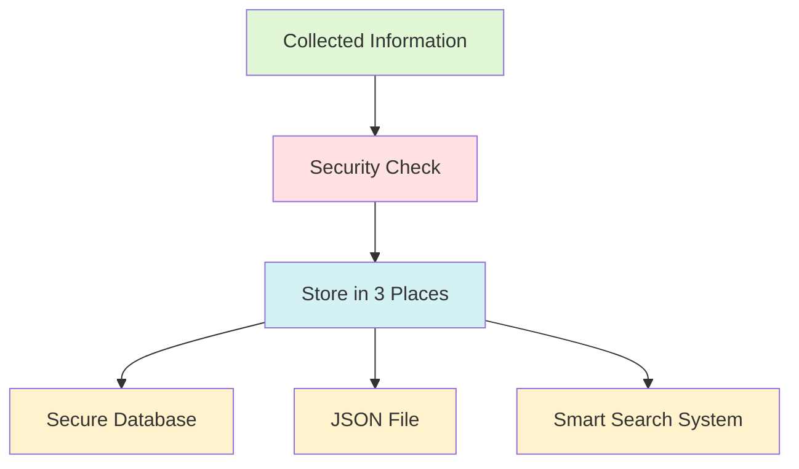
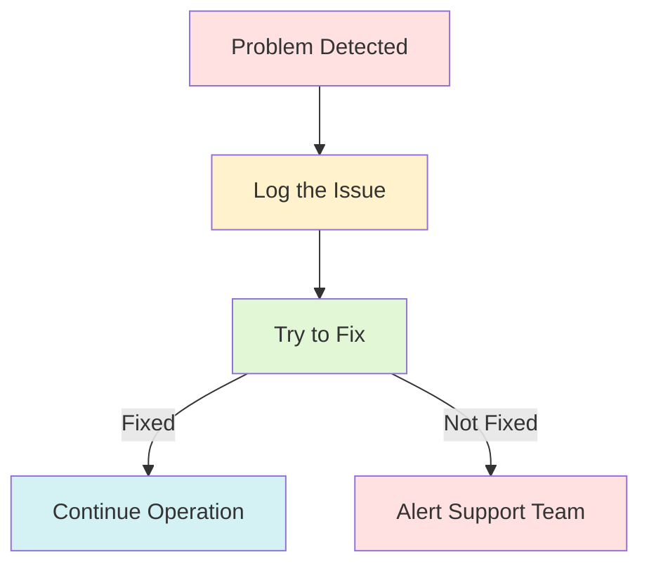

# Web Scraping System for Swiss Telecom Data
Last Updated: [29-03-2025]

## Visual System Overview

### 1. How The System Works - Basic Flow


### 2. Daily Operation Schedule


### 3. Safety System


### 4. Data Storage System


### 5. Error Handling


These diagrams show:
- How information flows through the system
- What happens during daily operations
- How data is stored safely
- What happens when problems occur
- How the system protects itself and the data

Color Key:
- 🔵 Light Blue: Scheduling and completion
- 🟢 Light Green: Active processes
- 🔴 Light Red: Decision points and safety checks
- 🟡 Light Yellow: Storage and logging

## What Does This System Do?

This system automatically collects information about mobile plans and services from three major Swiss telecommunications providers as an example but this is connected to the database which can be expanded:
- Swisscom
- Sunrise
- Salt

Think of it as a digital assistant that visits these websites every day at 2 AM, reads through their pages, and saves all the relevant information about mobile plans and services.

## Why Did We Build This?

1. **Automation**: Instead of manually checking these websites for information, the system does it automatically
2. **Consistency**: The information is collected in the same format every time
3. **Efficiency**: It can process multiple pages simultaneously, making it much faster than manual collection
4. **Intelligence**: The collected data is stored in a way that makes it searchable and analyzable

## How Does It Work?

### 1. Data Collection (Web Scraping)
- The system visits each telecom provider's website
- It identifies and follows links related to mobile services
- It collects information like:
  - Page titles
  - Descriptions
  - Content
  - URLs

### 2. Data Storage
The information is stored in three places:
1. **Database (Supabase)**: A secure online database that keeps track of which websites to check
2. **JSON File**: A structured file that contains all the collected information
3. **OpenAI Vector Store**: A smart storage system that makes the information easily searchable

### 3. Scheduling
- The system runs automatically every day at 2 AM
- It can also be started manually when needed
- If something goes wrong, it logs the error for review

### 4. Safety Features
- The system waits between requests to not overload the websites
- It automatically retries if a website is temporarily unavailable
- It skips broken links and invalid pages
- All sensitive information (like API keys) is stored securely

## What Information Is Collected?

For each page, the system collects:
```json
{
    "url": "The webpage address",
    "data": {
        "title": "The page title",
        "description": "The page description",
        "body": "The main content"
    }
}
```

## How Is It Deployed?

The system can run in two ways:

1. **Local Computer**:
   - All required software is installed
   - The system runs directly on the computer

2. **Docker Container** (Recommended):
   - Runs in an isolated environment
   - Easier to manage and maintain
   - More reliable operation

## Monitoring and Maintenance

The system creates detailed logs showing:
- When it started and finished
- Which pages it visited
- Any errors or issues encountered
- How many pages were successfully processed

## Current Limitations

1. **Website Changes**: If the telecom websites significantly change their structure, the system might need updates
2. **Rate Limits**: The system can only make a certain number of requests per minute to avoid overloading the websites
3. **Content Updates**: The system only checks once per day, so very recent changes won't be captured immediately

## Recommendations for Long-Term Improvement

1. **Enhanced Monitoring**:
   - Add real-time alerts for critical errors
   - Create a dashboard to visualize the collected data
   - Set up automated status reports

2. **Data Quality**:
   - Implement more sophisticated content validation
   - Add comparison with historical data to detect significant changes
   - Create automated tests to verify data accuracy

3. **System Expansion**:
   - Add more telecommunications providers
   - Include additional product categories (internet, TV packages)
   - Create an API for easy access to the collected data

4. **User Interface**:
   - Build a web interface to view and search collected data
   - Add manual control options for running the scraper
   - Create data export features in various formats

5. **Reliability Improvements**:
   - Add backup scheduling options
   - Implement automatic recovery procedures
   - Create failover systems for critical components

6. **Analytics**:
   - Add price tracking and comparison features
   - Implement trend analysis
   - Create automated reports of changes

7. **Security Enhancements**:
   - Regular security audits
   - Enhanced access control
   - Data encryption at rest

8. **Performance Optimization**:
   - Optimize database queries
   - Implement caching mechanisms
   - Add load balancing for high availability

## Support and Help

If you encounter any issues or need assistance:
1. Check the application logs for error messages
2. Verify that all required services (Supabase, OpenAI) are working
3. Contact the technical team for support

## Success Metrics

To measure the system's effectiveness, monitor:
1. Number of successfully collected pages per day
2. Error rate and types
3. Data freshness and accuracy
4. System uptime and reliability

Remember: This is a living system that needs regular attention and updates to maintain its effectiveness and reliability.
